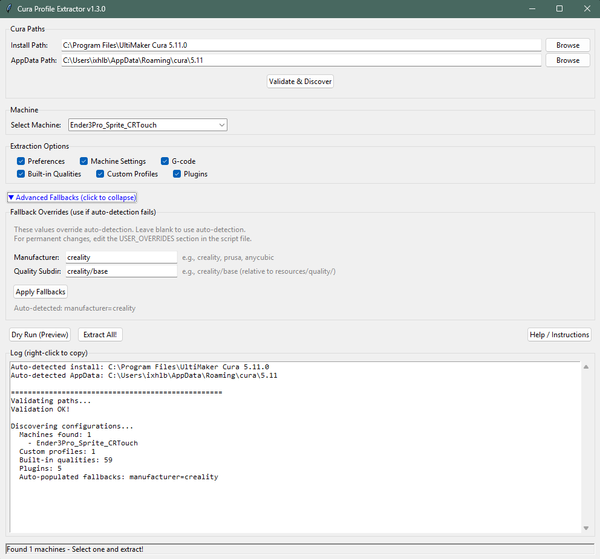

# Cura_Profile_Extractor
Python utility that extracts all Cura slicer settings into a single searchable JSON file by resolving Cura's 8-layer inheritance system. Tracks where each setting originates. Perfect for documenting printer setups, debugging slicer issues, or sharing configs. GUI and CLI modes, zero external dependencies, works with any printer manufacturer.

# Cura Profile Extractor

[](https://www.python.org/downloads/)
[](https://opensource.org/licenses/MIT)
[]()

**Extract all your Cura slicer settings into a single, searchable JSON file.**

Cura stores settings across 8+ different files with complex inheritance. This tool flattens everything into one file, tracking where each setting came from — perfect for documenting printer setups, debugging slicer issues, or sharing configurations.


*GUI mode with auto-detection and one-click extraction*

---

## Features

- **Complete Extraction** — Preferences, machine settings, G-code, quality profiles, plugins
- **Inheritance Tracking** — See exactly which file each setting comes from
- **Any Manufacturer** — Works with Creality, Prusa, Anycubic, Elegoo, Voron, and more
- **Dual Interface** — GUI (Tkinter) for ease of use, CLI for scripting/automation
- **Zero Dependencies** — Python standard library only, runs anywhere Python does
- **Cross-Platform** — Windows, Linux, and macOS path detection

---

## Quick Start

### GUI Mode (Recommended)

```bash
python cura_profile_extractor.py
```

1. Paths auto-detect on launch
2. Click **Validate & Discover**
3. Select your printer from the dropdown
4. Click **Extract All!**
5. Save your JSON file

### CLI Mode

```bash
# Auto-detect everything, extract first machine found
python cura_profile_extractor.py --cli

# Specify machine and output file
python cura_profile_extractor.py --cli --machine "Ender 3 Pro" -o my_profile.json

# Extract only G-code and machine settings
python cura_profile_extractor.py --cli --no-preferences --no-builtin --no-custom
```

---

## Installation

### Requirements

- Python 3.7 or higher
- Tkinter (included with most Python installations)
- Cura 4.x or 5.x installed

### Download

```bash
git clone https://github.com/ixhlbxi/Cura_Profile_Extractor.git
cd Cura_Profile_Extractor
python cura_profile_extractor.py
```

Or just download `cura_profile_extractor.py` directly — it's a single file with no dependencies.

---

## Output Structure

The extracted JSON contains:

```
{
  "_summary": {          // Quick overview of extracted data
    "machine_name": "Ender 3 Pro",
    "manufacturer": "creality",
    "quality_profile": "Standard",
    ...
  },
  "_key_settings": {     // Most important settings at a glance
    "layer_height": 0.2,
    "infill_sparse_density": 20,
    ...
  },
  "metadata": {          // Extraction info
    "cura_version": "5.11",
    "extracted_at": "2025-12-29T...",
    ...
  },
  "preferences": {...},  // Global Cura preferences
  "machine": {           // Full machine config
    "settings": {...},
    "inheritance_chain": [...],  // Shows definition hierarchy
    ...
  },
  "gcode": {             // Start/End G-code as line arrays
    "start_gcode": ["G28", "G29 P1", ...],
    "end_gcode": [...],
    ...
  },
  "extruders": {...},    // Extruder-specific settings
  "quality_builtin": {...},
  "quality_custom": {...},
  "plugins": [...]
}
```

---

## CLI Reference

```
usage: cura_profile_extractor.py [-h] [--cli] [--install PATH] [--appdata PATH]
                                  [--machine NAME] [-o FILE] [--raw]
                                  [--no-preferences] [--no-machine] [--no-gcode]
                                  [--no-builtin] [--no-custom] [--no-plugins]
                                  [--version]

options:
  -h, --help            show this help message and exit
  --cli                 Run in command-line mode (no GUI)
  --install PATH        Cura installation directory
  --appdata PATH        Cura user data directory
  --machine NAME        Machine/printer name to extract
  -o, --output FILE     Output JSON file path
  --raw                 Skip human-friendly formatting
  --version             show program's version number and exit

Skip options:
  --no-preferences      Skip global preferences
  --no-machine          Skip machine settings
  --no-gcode            Skip G-code extraction
  --no-builtin          Skip built-in quality profiles
  --no-custom           Skip custom quality profiles
  --no-plugins          Skip plugins list
```

---

## Troubleshooting

### "Could not auto-detect Cura install path"

Use the Browse button to manually select your Cura folder, or set the path in the script:

```python
# Near the top of cura_profile_extractor.py
USER_INSTALL_PATH_OVERRIDE = r"C:\Program Files\UltiMaker Cura 5.11.0"
```

**Typical locations:**
- **Windows:** `C:\Program Files\UltiMaker Cura X.X.X`
- **Linux:** `/usr/share/cura` or `~/.local/share/cura`
- **macOS:** `/Applications/UltiMaker Cura.app` or `~/Applications/...`

### "Could not auto-detect Cura AppData path"

**Typical locations:**
- **Windows:** `%APPDATA%\cura\5.11` (e.g., `C:\Users\You\AppData\Roaming\cura\5.11`)
- **Linux:** `~/.config/cura/5.11` or `~/.local/share/cura/5.11`
- **macOS:** `~/Library/Application Support/cura/5.11`

### "No machines found"

- Make sure you've created at least one printer profile in Cura
- Verify the AppData path points to the correct Cura version
- Check the `machine_instances` folder exists in AppData

### Wrong quality profiles detected

Expand the **Advanced Fallbacks** section in the GUI and manually set:
- **Manufacturer:** `creality`, `prusa`, `anycubic`, etc.
- **Quality Subdir:** `creality/base`, `prusa`, etc.

---

## Advanced Configuration

For permanent overrides, edit the `USER_OVERRIDES` section at the top of the script:

```python
# Path overrides
USER_INSTALL_PATH_OVERRIDE = r"C:\Program Files\UltiMaker Cura 5.11.0"
USER_APPDATA_PATH_OVERRIDE = r"C:\Users\You\AppData\Roaming\cura\5.11"

# Detection overrides
USER_MANUFACTURER_OVERRIDE = "creality"
USER_QUALITY_SUBDIR_OVERRIDE = "creality/base"

# Add custom manufacturer prefixes
USER_ADDITIONAL_MANUFACTURERS = ["biqu", "tronxy", "geeetech"]
```

---

## Use Cases

- **Documentation** — Record your exact slicer setup for reproducibility
- **Debugging** — Find where a mysterious setting is coming from
- **Sharing** — Export settings to share with others (cleaner than .curaprofile)
- **Backup** — Snapshot your config before major Cura updates
- **Comparison** — Diff two extractions to see what changed
- **Migration** — Reference when setting up a new machine

---

## How It Works

Cura uses a stacked profile system with 8 layers of inheritance:

```
Layer 0: User overrides (per-session changes)
Layer 1: Custom quality profile
Layer 2: Intent profile
Layer 3: Quality profile
Layer 4: Material profile
Layer 5: Variant (nozzle)
Layer 6: Definition changes (YOUR CUSTOM G-CODE LIVES HERE)
Layer 7: Base machine definition
   └── Inherits from: manufacturer_base → fdmprinter
```

This tool walks the entire stack, resolves all inheritance, and produces a flat JSON with source attribution for every setting.

---

## Contributing

Contributions welcome! Please:

1. Fork the repository
2. Create a feature branch (`git checkout -b feature/amazing-feature`)
3. Commit your changes (`git commit -m 'Add amazing feature'`)
4. Push to the branch (`git push origin feature/amazing-feature`)
5. Open a Pull Request

---

## License

MIT License — see [LICENSE](LICENSE) for details.

---

## Changelog

### v1.3.0 (2025-12-29)
- Added: Auto-population of Advanced Fallbacks fields on Validate & Discover
- Added: Right-click context menus (Cut/Copy/Paste/Select All) on all text fields
- Added: Help / Instructions button with comprehensive documentation popup

### v1.2.1
- Added: USER_OVERRIDES section for power user fallback configuration
- Added: Collapsible "Advanced Fallbacks" panel in GUI
- Added: Linux and macOS path detection support

### v1.2.0
- Fixed: Nested G-code values now properly humanized
- Fixed: Removed hardcoded manufacturer references for full portability
- Added: Manufacturer auto-detection from definition chain

### v1.1.0
- Added: Human-readable formatting (arrays instead of semicolon-delimited strings)
- Added: `_summary` and `_key_settings` sections

### v1.0.0
- Initial release

---

## Acknowledgments

Built for the 3D printing community. Special thanks to the Cura team for their [documentation on the profile system](https://github.com/Ultimaker/Cura/wiki/Profiles-&-Settings).
